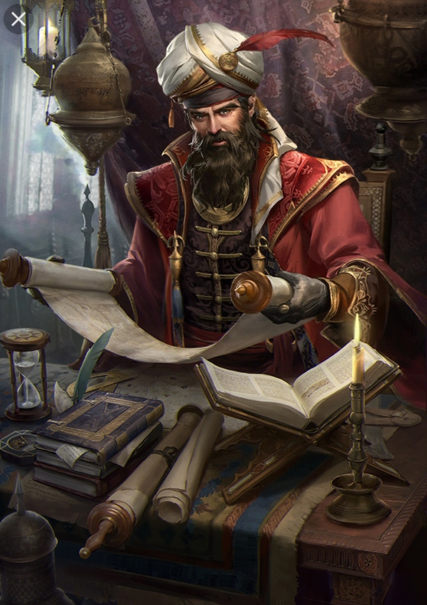

(Image: Altirian Scholar)

Scholars study magic from an academic point of view. Many have been studying magic even before even the Advent of Ether, but since then, most have found their abilities multiplied. What used to be a great achievement a few years before has now become a common task for students. They tend to live in Academies, exclusive academic societies akin to monasteries, but hermits are common too.

Mechanically wise, Scholars get very few skills that are truly passive. Instead, many of the usual passive slots are Active auras that need to be managed in the spot. Ex: Instead of having a talent that gives frostbolt a chance to freeze the target, it's an active with a slightly higher chance. This active may not stack with many others in the same tier. 
Scholars use Ether for their spells, a resource very similar to Mana, but a bit trickier to regenerate.
Scholars also get Metamagic abilities, allowing them to use more Ether to improve their next spell. They use Metamagic Runes, which recharge every 5 minutes. Scholars get more of them as they level up. Ex: Metamagic: Reach: Improves the range of your next magical ability by 50%.

Abilities:
- Frost Forking: Increases the number of targets hit by your Frostbolt by 2. Lasts for 12 seconds, 30 second CD
- ...

Subclasses:
- Artificer: Hybrid with Artisan. Creates golemns and assigns them abilities.
- Warmage: Can use Medium Armor and Melee Weapons. Hybrid with Warrior or Knight.
- Summoning: 
- Transmutation: 
- Evocation: Elemental damage. Big damage, low utility.

### First Encounter:
1. Something something academy

### Second Encounter:
1. Studying magical anomalies throughtout the world, chimeras or something...
2. 