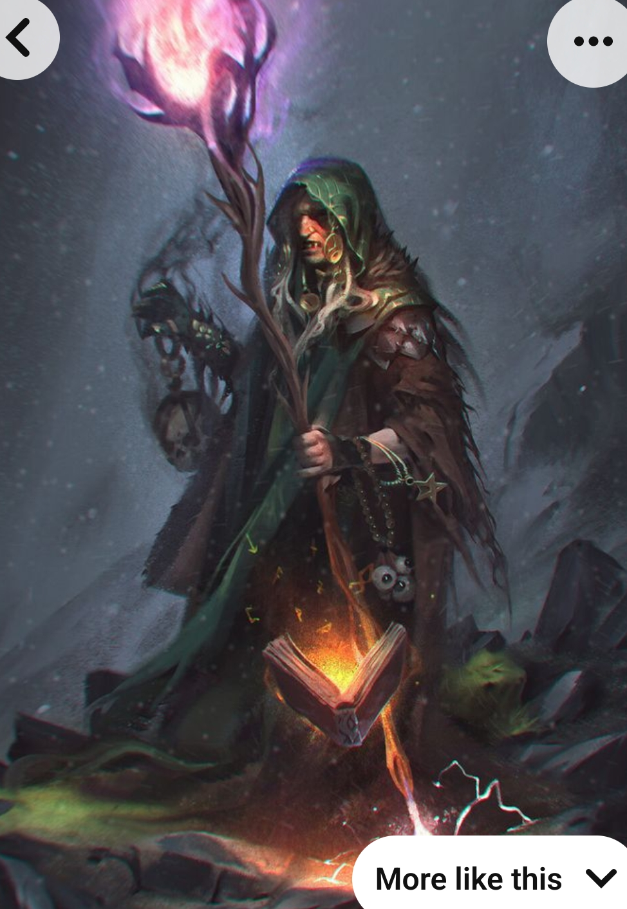

(Image: Forsaken Witch)

Besides Scholars, Witches have the most variety in ability choices. There's a lot of different witches all throughout the lands. Some form covens and look for devouts, others stay alone and sell their services for favors, some serve their community without asking for much in return, etc. They all have different things to teach, but what they ask in return might not be worth the cost for many

Ability types: 
- Poison, Disease, Curses
- Stealth
- Blood Magic
- Shadow Magic
- Fire Magic
- Demonic Magic
- Necromancy
- Buffs for allies or self (usually with drawbacks)

Ability Ideas:
1. Nevermend: Reduces healing received by the target by 100%, slowly losing potency (10% per second). Target cannot receive a curse for 30 seconds after being cursed.
2. Witch Eye: Buff an ally, boosting their stats for quite a bit for 20 seconds, but causing them to lose a lesser amount of stats for 10 seconds after the effect ends.
3. Poisoned Weapon: Coat the weapon of an ally with deadly poison. Only 1 ally at a time.
4. Twist of Fate: Upon casting this ability, your next 3 damage or healing abilities will not crit, but the next two after those will.
5. Blood Pact: Heal the target for X, but reduces your casting speed by 30% for 5 seconds. 12 second CD. 3 sec CT.
6. Bone Shield: Places a shield on a target. That shield will reflect damage back to attackers.
7. Shadow and Fire tricks to spam.
8. Dark Bargain: In the next 8 seconds, you must cast 4 abilities. If you do so, gain 20% haste and an absorb shield, otherwise, lose 10% haste for 20 seconds.
9. Mist Step: Teleport yourself towards a short distance of your choice and then become stealthed for 8 seconds. 
10. Animate Dead: Raise an undead minion that progressively loses health and is incapable of regenerating it. You can have multiple undead minions, but each one active reduces your Focus by 10%.
11. 

### First Encounter:
1. Reverting a Curse/Cursing someone...

### Second Encounter:
Learn how to Summon...
1. 

### Experience:
- Witches can summon a random demon/spirit a day to fight it (alone, in an instance). Defeating the demon grants them a buff and experience, but demons can leave long debuffs if the Witch is not prepared properly. (For example, the witch may choose to curse themselves before the demon uses a great and long curse to prevent a bigger evil). At max level, the demon grants a buff and reagents.