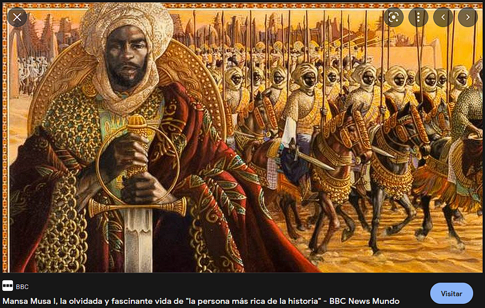

The Mali themed empire of Bassadya is the most bountiful of all. Gold, emerald and ruby adorn their streets, and its little citizens are born into abundance. It is, however, built upon the literal sweat and blood of tens of thousands of slaves. They trade some of their neverending supply of gold for the loyalty of rivaling trives, who sell them their prisoners as slaves. 

Slaves are divided in tiers according to the value they provide for the Bassadi people:
1. At the top we have the chosen few, the specialized workers that provide luxuries to the richest citizens. All slaves aspire to be in this category, as they are treated the best. It ranges from artisan, to personal guard to concubine.
2. In the middle is the common slave, who provides services and goods for humbler families.
3. At the bottom is the imperial worker slave, those without a single master. These work the fields, the roads and the buildings. Most slaves are in this category.

They trade their mineral resources, like gold, jewels and salt, and slaves mainly for food, as Bassadi land is far from fertile enough to sustain their enormous slave population.

It is a commonly held belief that a slave must be treated with a certain level of respect, as it is a necessary evil, as decreed by the King Messiah Souleyman three hundred years ago. Back then, Bassadya, just a simple village, was under constant pillaging from neighbouring tribes. They found out that they were on top of unimaginable riches that would allow them to defend themselves, if they were able to trade. Nonetheless, they were too few to actually be able to do so. That is when Souleyman decided that Bassadya would need slavery to survive. Nowadays, it is so engrained within Bassadi culture that beliefs of supremacy over enslaved tribes are commonheld.

Heirs of the King Messiah have a lot to live up to. They must at the very least preserve what the last emperor or empress left them. They must simultaneously be ambitious but conservative. The current Empress, Babakari, was not living up to expectations up until the Advent of Ether, when she gained a much more commanding presence. Coincidentally, she then made the decision to conceal her appearance under a robe of gold and alabaster thread.

[[The empress becomes a chimera, becoming a golden draenei-like creature. The specter inhabiting her is one of ambition and wrath.]]

There are rumors of a slave rebellion, but there have always been. It is unlikely, given the complicity between the clergy and the Imperial court. The dominant rethoric is one that glorifies labor and the correct assignment of people to the job they are best at. There is a strict emphasis on trusting the heirarchy in place, and trusting that, even if masters can be cruel sometimes, it is because you did not do your job correctly. Following these principles is said to guarantee a happy and meaningful life.
There have been some claims of slaves being able to use magic since the Advent of Ether, but they are not taken seriously by most.

[[Sakar, a young slave man, has been a slave for a few years now. He was once a soldier, but lost a battle and was sold as a slave to the Bassadya empire. Given his skill, he was purchased by a rich family to serve as a guard. He served his duty well, even though resentful, but he was demoted due to a dispute with his master. His master tried to make him his concubine, but he refused, his master tried to kill him but Sakar, after a struggle, summoned a knife out of nowhere and slit his master's throat. He managed to run away (as there was nobody guarding the master but him) and is looking for other slaves with magical abilities and freeing them to organize an uprising against the Bassadi.]]

Piracy is an annoyance on trade by sea from Bassadya
