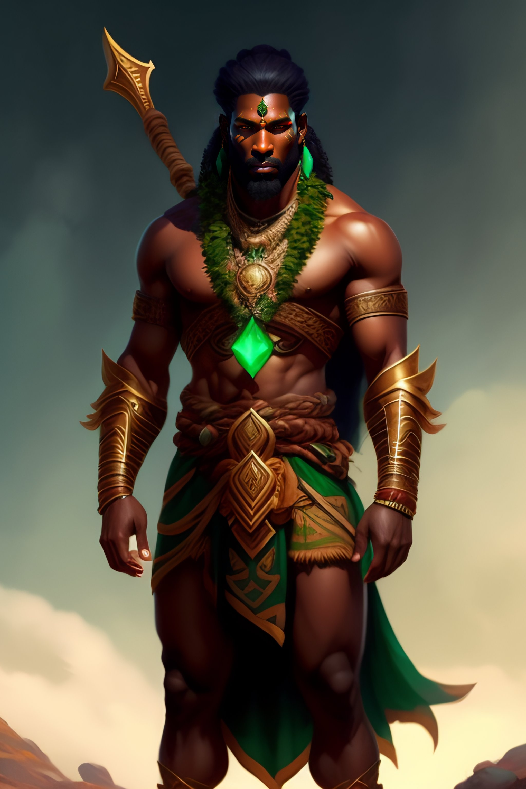

(Image: Bassadyan Druid)

Druids can shapeshift into multiple animal forms, buffing themselves each time they do it. Shapeshifting has two variants: if you use it with an active aura (Nature Call), you gain extra buffs and abilities while shapeshifted, but uses a special Druid resource called Natural Favor. The other version has fewer buffs and abilities, but does not consume Natural Favor.

Nature Call also affects other abilities, such as healing or damage ones. Abilities affected by it have it described so in their description, along with how much Natural Favor they spend.

There is a special Druid Ability, available once a day, called Gift of the Grove, which immediately restores all of the druid's Natural Favor. 

The amount of Natural Favor is increased every level and with skills. Druids restore Natural Favor (and gain XP) upon helping animals and performing special rituals.

Abilities:
- Wall of Thorns: AoE area that slows enemies by 80% and deals DoT.
- 

Wildshifts:
- Raven: Allows you to fly down at the rate you deem appropriate. Natural Call: 
- Tiger: Allows you to Stealth, Ambush and Leap. NC: ... Skill: When NC Tiger, become a Thunder Tiger, gaining ability to Lightning abilities.
- Bear: Allows you to Taunt, Cleave, Stun and Charge.
- Spider: Allows you to Net, Poison and Heal.
- 