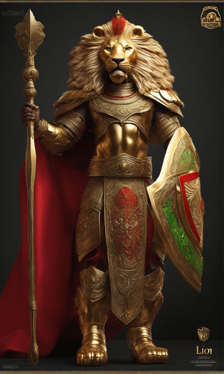

(Image: Bassadyan Knight)

Knights are walking fortresses capable of taking multiple foes at once and walk out unscratched. They use heavy shields, one handed weapons and heavy armor to resist all kind of attacks. Knights are almost always well positioned members of society, and the few exceptions work hard to earn their status. 

Their main mechanic is Posture: An additional resource bar. You can toggle an ability to take damage into this bar instead of your health, but if it reaches 0 you are stunned for a couple of seconds and lose a bit of threat. You can regain your Posture with certain abilities. Elite Bosses deal reduced damage to your Posture.

Stances: The Knight can choose between a few stances that can help protect him or his nearby allies. Dispersion Stance: reduces AoE damage taken by allies within 10m by 25%. (Possibly, the knight takes some of that damage, up to a cap). 

Abilities:
1. Shield Bash (Core Ability): Delivers a powerful shield strike, momentarily stunning the target and generating threat. 
2. Guardian's Presence (Core Ability): Emits a calming aura, reducing the threat generated by nearby allies. While active, the Knight gains increased threat generation. Does not work on targets that have Guardian Pressence active
3. Vigilant Strike (Core Ability): Strikes with precision, dealing damage and increasing their Posture.
4. Parry: Same as a Warrior's.
5. Defend: Same as a Warrior's.
6. Raise Shield: For the next 3 seconds, increases your chance to Block by 15%. Gain Posture.
7. Protect: Shield yourself or an ally in nearby range (8yd) for a small duration. Gain Posture.
8. 

Paladin spec:

1. Passive Auras for nearby players. Aura Mastery is an active ability that triggers special aura effects at the expense of losing the passive for some seconds.
2. Blessings.
3. 

Bulwark spec:
1. (Shield, passive) Whenever you take damage over 10% of your HP, you will counter-attack with your main hand for 200% weapon damage and receive a small absorb shield.
2. (Passive) When you lose posture, you retain threat and take 20% less damage.

### Experience:
- Knights gain extra experience from a daily duel with another player.