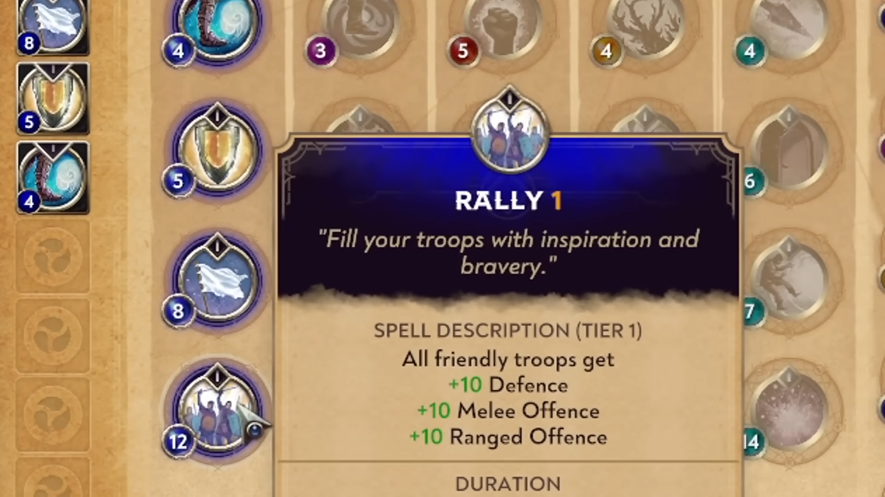

This type of ability is only available for Commanders in sieges. There are different sorts of abilities, they use a different resource. Three broad categories: squad enhancement, commander enhancement and assault.

Squad enhancement improves your squad in different ways.
Commander enhancement either buffs the commander or gives them new, strong abilities.
Assault is focused on gameobjects in the siege, like placing obstacles, destroying them, etc.