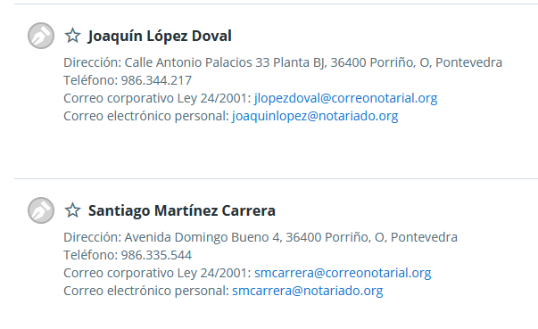

Me atendió Samuel en Santiago Martínez Carrera. Es PAE.

- Como montar una empresa? Para empezar me renta más ser autónomo? Cuando debería conformarla?
- Como representar legalmente a una empresa para trámites burocráticos. 
- Y a autónomos? 

- Como se designa un apoderado en Galicia? A través del Registro Electrónico de Apoderamientos o el REAG

Constitución empresa PAE electrónico.
Estatutos
Identidad socios
Designación administrador
Domicilio social
Acta de (no se el nombre. Determina cuanto capital ha aportado cada socio)
Escoger una categoría empresarial (programación software)
Documento de titularidad
Dar la empresa de alta ante la Agencia Tributaria 
Capital social mínimo de 3.000. facil de evitar. Se declara que se ha puesto ese dinero, o se ponen propiedades como capital (el portatil, coche, etc).