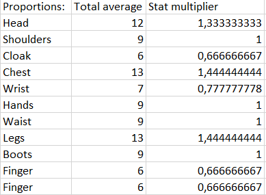

Items are created with "stat budgets", which take their item level to calculate how many stats or effects should an item have. Different slot types have different stat budget multipliers (pic related).

Sufixes allocate those budgets between a determined set of stats in different proportions ("of the Bear" gives 70% of that as Stamina, 30% as Strength).

Each stat type has a weight based on their value