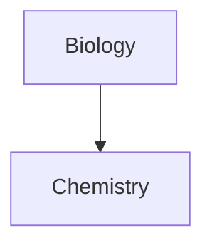

# Headings
For headings just use # and a blank space. Each new # lowers the level of the header.
## Heading 2
### Heading 3
# Formatting Emphasis
For emphasis, a single `*` or `_` will produce *italic text*, while two of them will make it **bold**, or even _**combine the two**_.
To scratch, put between `~~`
To highlight, put between `==`
For a horizontal bar, use three of any of `*`, `-` or `__`
***
# Lists
For lists use - (can be indented) or number+dot:

- You can do it
	- Like this
1. Or even
2. like
	1. This

# Checklists

Same as lists, but with [x], [?] or empty brackets before the text:
- [x] Completed task
- [?] Also completed
- [ ] Not completed

# CreateNotes

Just enclose the name of the note in `[[]]`
[[Note Link]]
[[Test Note]]

# Embed, # Files, # URLs

You can link sections of different files with `[[# Enter heading name here]]`. 
[[# Heading 1]]

If you want to reference from another file you do 
[[Note Link# Heading]]

Embedding files or web URLs (to just link, ommit the '!')
![[Note Link]]

You can embed images from your PC

or from URLs!


Links are also automated (can be renamed):
http://obsidian.md - automatic!
[Obsidian](http://obsidian.md)

# Quotes

For blockquotes use a single > character, followed by the quote, and then a \- for the author

> This is a very deep quote
> \- Very deep guy, 1993

# Code

Like discord, use \`\` for code, with three backticks + language acronym for highlighted text.

```py
def ExampleFoo:
	return 'Hello world!'
```

# Tables

List words with | in the middle. Embed between `:` to justify

Header 1 | Header 2 | Header 3
--|--|--
Content 1|Content 2|Content 3
Content 1+1|Content2+2|Content3+3

# Footnotes

For simple footnotes [^1] or long ones [^bignote] :

[^1]: Just do it like this

[^bignote]: or like this.
	and so on
	and on

# Math 
There's also a LaTeX-like syntax:
$$\begin{vmatrix}a & b\\
c & d
\end{vmatrix}=ad-bc$$
It uses [Mathjax](http://docs.mathjax.org/en/latest/basic/mathjax.html)

If you want to comment something and have it be invisible just enclose it in `%%` %%just like this%%

# Callouts are pretty
> [!INFO] Info title
> Here's some useful info. You can write **_any obsidian markup_** here

Change INFO for any of the following
-   note
-   abstract, summary, tldr
-   info, todo
-   tip, hint, important
-   success, check, done
-   question, help, faq
-   warning, caution, attention
-   failure, fail, missing
-   danger, error
-   bug
-   example
-   quote, cite

# Diagrams 

Use [Mermaid](https://mermaid-js.github.io/) to render diagrams, charts and whatnot:

